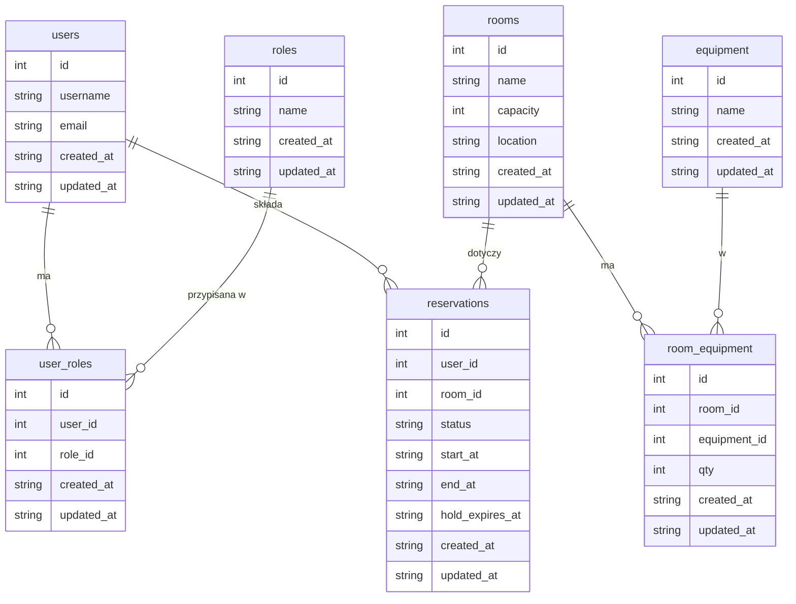

# MeetSpace Plus

**System rezerwacji sal konferencyjnych** – projekt zaliczeniowy. Backend w Django/DRF, frontend w Vue 3, PostgreSQL, RabbitMQ, Celery.

---

## 1. Opis projektu i skrót funkcji

MeetSpace Plus umożliwia użytkownikom przeglądanie sal, sprawdzanie dostępności i rezerwowanie slotów. Rezerwacja tworzona jest w statusie **pending** z **holdem 15 minut**; po potwierdzeniu przechodzi do **confirmed** lub po upływie holda / anulowaniu do **canceled**. System egzekwuje brak nakładania się rezerwacji w tej samej sali (kolizje → HTTP 409).

**Główne funkcje:**

- Uwierzytelnianie: **JWT** dla SPA (użytkownicy), **sesja** dla Django Admin (administrator).
- Role **admin** i **user** (M:N). Panel administratora: Django Admin + widoki SPA (np. zarządzanie salami).
- Sale: nazwa, pojemność, lokalizacja; sprzęt (equipment) i powiązanie **room–equipment** (M:N z `qty`).
- Rezerwacje: `pending` / `confirmed` / `canceled`; hold 15 min; walidacja kolizji `(room_id, [start_at, end_at])`; godziny robocze (domyślnie 8–18).
- Zadania asynchroniczne: **expire_hold** (anuluje pending po wygaśnięciu holda), **send_notifications** (hook pod e‑mail/WebSocket), **reconcile_pending** (Beat: sprzątanie starych pending co 5 min).
- Frontend korzysta z API (axios), stany loading/error, widoki: logowanie, lista sal, kalendarz, Moje rezerwacje, panel admina (sale).

---

## 2. Uzasadnienie doboru technologii

| Technologia | Uzasadnienie |
|-------------|--------------|
| **Django / Django REST Framework** | Dojrzały ekosystem, ORM, admin poza pudełkiem, migracje, DRF: serializery, widoki zbiorowe, paginacja, JWT (SimpleJWT) i sesja w jednej aplikacji. Szybki rozwój API REST. |
| **Vue 3 + Vite + Pinia + Vue Router** | Reaktywność bez nadmiaru, Single-File Components, Vite – szybki dev i build. Pinia – prosty store; Vue Router – SPA. Łatwa integracja z axios i JWT. |
| **PostgreSQL** | Relacyjna baza w 3NF, wsparcie dla zaawansowanych constraintów (np. `ExclusionConstraint` pod brak nakładania slotów), indeksy, transakcje. Stabilność i skalowalność. |
| **RabbitMQ** | Broker dla Celery: trwałe kolejki, retry, możliwość DLQ. Asynchroniczne wygaszanie holdów i powiadomienia bez blokowania requestów. |

---

## 3. Instrukcja uruchomienia (Docker)

Cały projekt (backend, frontend, baza, kolejki) uruchamiany jest przez Docker Compose.

### Wymagania

- Docker i Docker Compose

### Komendy

```bash
# 1) Start wszystkich usług (backend + frontend + db + celery)
cd backend
docker compose up -d

# 2) Migracje
docker compose exec backend python manage.py migrate

# 3) Dane seed (sale, equipment, userzy, role, rezerwacje)
docker compose exec backend python manage.py seed

# Opcjonalnie: seed od zera (--reset usuwa dane i odtwarza)
docker compose exec backend python manage.py seed --reset

# 4) Superuser (Django Admin) – ręcznie
docker compose exec backend python manage.py createsuperuser

# lub demo admin (admin1@example.com, admin2@example.com; hasło: DEMO_PASSWORD=DemoPass!1)
docker compose exec backend python manage.py create_demo_admin
```

**Seed** tworzy m.in. 10 sal, 5 equipment, 20 room_equipment, 10 użytkowników (2 admin), 20–30 rezerwacji. Hasło użytkowników z `seed`: `seedhaslo1`. Dla `create_demo_admin`: `DemoPass!1` (lub zmienna `DEMO_PASSWORD`).

### Dostępne usługi

| Usługa | URL |
|--------|-----|
| Frontend | http://localhost:5173 |
| Backend API | http://localhost:8000 |
| Django Admin | http://localhost:8000/admin/ |
| pgAdmin | http://localhost:5050 |
| RabbitMQ Management | http://localhost:15672 (guest/guest) |

Hot reload działa automatycznie dla frontendu (`src/` zamontowany jako volume).

---

## 4. Architektura warstwowa i linki do plików

| Warstwa | Opis | Pliki |
|---------|------|-------|
| **Modele (ORM)** | Encje 3NF: users, roles, user_roles, rooms, equipment, room_equipment, reservations. | [`backend/accounts/models.py`](backend/accounts/models.py), [`backend/rooms/models.py`](backend/rooms/models.py), [`backend/reservations/models.py`](backend/reservations/models.py) |
| **Serwisy (logika biznesowa)** | Rezerwacje: walidacja, kolizje, hold, wywołania zadań Celery. | [`backend/reservations/services/booking.py`](backend/reservations/services/booking.py), [`backend/reservations/services/availability.py`](backend/reservations/services/availability.py) |
| **Widoki (API)** | Endpointy REST: auth, me, rooms, reservations. | [`backend/accounts/views.py`](backend/accounts/views.py), [`backend/rooms/views.py`](backend/rooms/views.py), [`backend/reservations/views.py`](backend/reservations/views.py) |
| **Serializery** | Walidacja wejścia/wyjścia, mapowanie ORM ↔ JSON. | [`backend/accounts/serializers.py`](backend/accounts/serializers.py), [`backend/rooms/serializers.py`](backend/rooms/serializers.py), [`backend/reservations/serializers.py`](backend/reservations/serializers.py) |
| **Zadania asynchroniczne** | expire_hold, send_notifications, reconcile_pending. | [`backend/reservations/tasks.py`](backend/reservations/tasks.py) |
| **Konfiguracja** | DRF, JWT, Celery, Beat, drf-spectacular. | [`backend/config/settings/base.py`](backend/config/settings/base.py), [`backend/config/celery.py`](backend/config/celery.py), [`backend/config/urls.py`](backend/config/urls.py), [`backend/config/api_urls.py`](backend/config/api_urls.py) |

---

## 5. ERD (diagram encji i relacji)

Diagram 3NF (skrót). Pełna wersja z indeksami i ograniczeniami: **[`docs/erd.md`](docs/erd.md)**.



Braku nakładania slotów `(room_id, [start_at, end_at])` nie da się w pełni wymusić na samym SQLite; w projekcie jest on egzekwowany w **serwisie** `booking.create_reservation` (409 przy kolizji). W PostgreSQL możliwy jest `ExclusionConstraint`.

---

## 6. API: Swagger i przykładowe requesty

### Gdzie jest Swagger

- **Swagger UI:** [http://localhost:8000/api/docs/](http://localhost:8000/api/docs/)  
- **OpenAPI (JSON):** [http://localhost:8000/api/schema/?format=json](http://localhost:8000/api/schema/?format=json)  

(drf-spectacular; schema z `SPECTACULAR_SETTINGS` w `config.settings.base`).

### Przykładowe requesty

**Login (JWT):**

```bash
curl -X POST http://localhost:8000/api/auth/login/ \
  -H "Content-Type: application/json" \
  -d '{"username":"admin1@example.com","password":"DemoPass!1"}'
# Odpowiedź: {"access":"<JWT>","refresh":"<JWT>"}
```

**Lista sal (z JWT):**

```bash
curl -H "Authorization: Bearer <ACCESS_TOKEN>" http://localhost:8000/api/rooms/
```

**Utworzenie rezerwacji (z JWT):**

```bash
curl -X POST http://localhost:8000/api/reservations/ \
  -H "Authorization: Bearer <ACCESS_TOKEN>" \
  -H "Content-Type: application/json" \
  -d '{"room":1,"start_at":"2025-06-15T10:00:00+02:00","end_at":"2025-06-15T11:00:00+02:00"}'
# 201: rezerwacja pending, hold 15 min, zaplanowany expire_hold
# 409: kolizja z istniejącą rezerwacją
```

**Moje rezerwacje:**

```bash
curl -H "Authorization: Bearer <ACCESS_TOKEN>" "http://localhost:8000/api/reservations/?mine=1"
```

---

## 7. Kolejki: opis zadań i jak je zobaczyć w logach

| Zadanie | Opis | Wywołanie |
|---------|------|-----------|
| **expire_hold** | Anuluje rezerwację `pending`, gdy `hold_expires_at <= now`. Retry przy błędach. | `apply_async(args=[reservation_id], eta=hold_expires_at)` przy `create_reservation`. |
| **send_notifications** | Dummy: loguje zdarzenie (`created` / `confirmed` / `canceled` / `hold_expired`). Hook pod e‑mail / WebSocket. | `delay(reservation_id, event)` przy confirm/cancel (w serwisie); opcjonalnie przy create. |
| **reconcile_pending** | Sprząta stare `pending` (`hold_expires_at <= now`). | Celery Beat co 5 min ( `reconcile-pending` w `CELERY_BEAT_SCHEDULE`). |

### Jak zobaczyć zadania w logach

Logi workera Celery (w Docker):

```bash
cd backend
docker compose logs -f celery
```

Szukaj wpisów m.in.:

- `expire_hold canceled` / `expire_hold skip` (reservation_id, reason),
- `send_notifications` (reservation_id, event),
- `reconcile_pending done` (canceled_count).

Beat:

```bash
docker compose logs -f celery-beat
```

Widać m.in. odpalenia `reconcile-pending` co 5 minut.

---

## 8. Testy

### Backend (pytest)

```bash
cd backend
docker compose exec backend pytest
```

Konfiguracja: `backend/pytest.ini` (testpaths=tests, python_files=test_*.py).
Testy logiki rezerwacji i kolizji: `backend/tests/reservations/test_booking.py`, `test_reservations_api.py`; zadania: `test_tasks.py`.

### Frontend (Vitest)

```bash
cd backend
docker compose exec frontend npm run test:run
```

---

## 9. Konwencja commitów i wskazówki (≥40 commitów)

### Konwencja

Proponowana **Conventional Commits**:

- `feat: ...` – nowa funkcjonalność (np. `feat(api): endpoint confirm reservation`)
- `fix: ...` – poprawki (np. `fix(booking): kolizja przy granicy slotu`)
- `docs: ...` – dokumentacja (README, ERD, komentarze)
- `test: ...` – testy (np. `test(reservations): kolizje przy create`)
- `chore: ...` – zależności, Docker, konfiguracja (np. `chore(deps): drf-spectacular`)

Opcjonalnie scope w nawiasie: `feat(rooms): capacity i location`.

---

## Licencja

Zob. [LICENSE](LICENSE).
