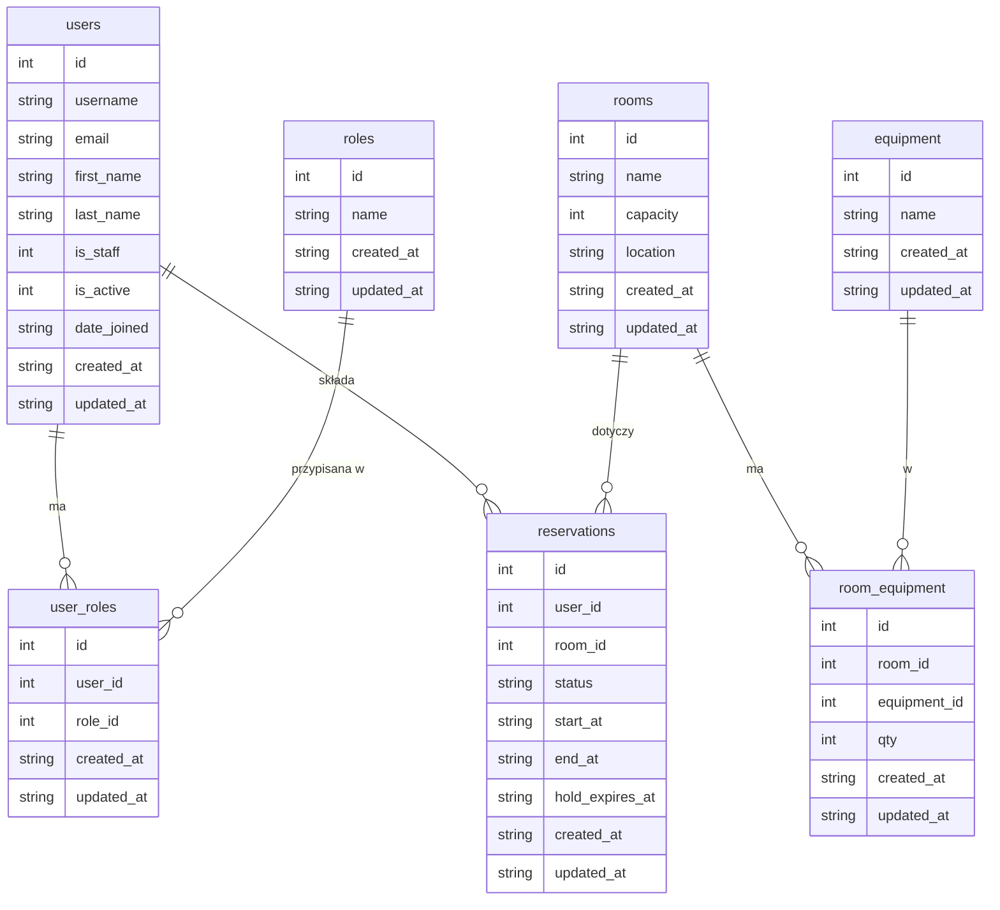

# ERD – MeetSpace Plus

Diagram encji i relacji (3NF). Brak nakładania się rezerwacji w tym samym pokoju jest egzekwowany w warstwie serwisowej (409 przy kolizji).

## Indeksy

| Tabela       | Indeks                       | Cel                          |
|-------------|------------------------------|------------------------------|
| reservations | `(room_id, start_at)`       | wyszukiwanie kolizji, listy   |
| reservations | `(user_id, start_at)`       | rezerwacje użytkownika       |

## Ograniczenia unikalności

| Tabela       | Constraint                      |
|-------------|----------------------------------|
| user_roles  | `(user_id, role_id)` – para 1:1 |
| room_equipment | `(room_id, equipment_id)` – para 1:1 z `qty` |

## Zależności (3NF)

- **users, roles**: atrybuty zależne tylko od klucza głównego.
- **user_roles**: tabela łącząca M:N User–Role; atrybuty zależne od `(user_id, role_id)`.
- **rooms, equipment**: atrybuty zależne tylko od klucza głównego.
- **room_equipment**: M:N Room–Equipment z atrybutem `qty` zależnym od pary `(room_id, equipment_id)`.
- **reservations**: atrybuty zależne od `id`; `user_id`, `room_id` – klucze obce.
